# V0.2 Recovery State Machine

```mermaid
stateDiagram-v2
  [*] --> INIT
  INIT --> BIAS_STABILIZE: reset/configure/bias ok
  BIAS_STABILIZE --> COMM_CHECK: settle timeout elapsed
  COMM_CHECK --> WAIT_DRDY: start continuous once
  WAIT_TRIGGER --> USB_FLUSH: output tick + decimated sample
  WAIT_TRIGGER --> WAIT_DRDY: no output permit; keep ADC pipeline moving
  WAIT_DRDY --> READ_SAMPLE: DRDY event
  READ_SAMPLE --> PROCESS_SAMPLE: SPI read ok
  PROCESS_SAMPLE --> DARK_CALIBRATE: link_check ok during self-check
  DARK_CALIBRATE --> WAIT_DRDY: start TIM6 output permits
  PROCESS_SAMPLE --> WAIT_DRDY: calibration sample accepted
  PROCESS_SAMPLE --> WAIT_TRIGGER: run sample processed
  USB_FLUSH --> WAIT_DRDY: enqueue output sample

  WAIT_DRDY --> RECOVER: DRDY timeout
  READ_SAMPLE --> RECOVER: SPI timeout/error
  PROCESS_SAMPLE --> RECOVER: config mismatch/link_check error
  COMM_CHECK --> RECOVER: start continuous error

  RECOVER --> WAIT_DRDY: continuous restart for SPI retry ok
  RECOVER --> BIAS_STABILIZE: reset + configure + link_check ok
  RECOVER --> FAULT: recovery attempts over threshold
  INIT --> FAULT: non-recoverable init failure
  FAULT --> FAULT: periodic diagnostic report
```

策略摘要：

- `SPI timeout`: 重新发起当前 pipeline 的转换，最多 `APP_RECOVERY_SPI_RETRY_LIMIT = 3` 次。
- `config mismatch`: 执行 `adc_protocol_reset() + adc_protocol_configure_default() + adc_protocol_link_check()`，成功后回到 `BIAS_STABILIZE` 并重新自检、校准。
- `DRDY timeout`: 同配置不一致，走 ADC 重配链路。
- `USB busy overflow`: 不进入 `RECOVER`，只记录 `DIAG_FAULT_USB_BUSY_OVERFLOW` 并在被保留的新帧上置 `SAMPLE_FLAG_USB_OVERFLOW`。
- 连续失败超过 `APP_RECOVERY_HOLD_THRESHOLD = 3` 或恢复次数超过对应上限时进入 `APP_STATE_FAULT`。
